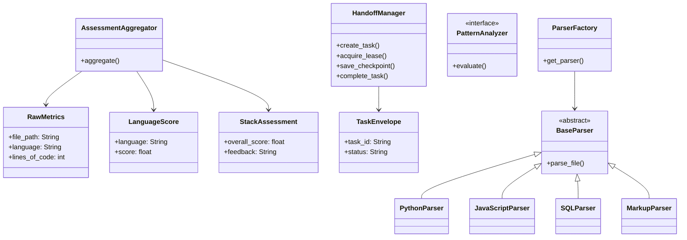

# Диаграмма классов

```mermaid
classDiagram
    class RawMetrics {
        +file_path: String
        +language: String
        +lines_of_code: int
    }

    class LanguageScore {
        +language: String
        +score: float
    }

    class StackAssessment {
        +overall_score: float
        +feedback: String
    }

    class TaskEnvelope {
        +task_id: String
        +status: String
    }

    class HandoffManager {
        +create_task()
        +acquire_lease()
        +save_checkpoint()
        +complete_task()
    }

    class BaseParser {
        <<abstract>>
        +parse_file()
    }

    class PythonParser
    class JavaScriptParser
    class SQLParser
    class MarkupParser

    class ParserFactory {
        +get_parser()
    }

    class PatternAnalyzer {
        <<interface>>
        +evaluate()
    }

    class AssessmentAggregator {
        +aggregate()
    }

    BaseParser <|-- PythonParser
    BaseParser <|-- JavaScriptParser
    BaseParser <|-- SQLParser
    BaseParser <|-- MarkupParser
    ParserFactory --> BaseParser
    HandoffManager --> TaskEnvelope
    AssessmentAggregator --> RawMetrics
    AssessmentAggregator --> LanguageScore
    AssessmentAggregator --> StackAssessment
```   