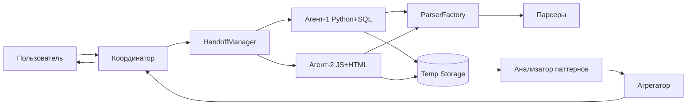

# Диаграмма компонентов 

```mermaid
graph LR
    UI[Пользователь] --> Coord[Координатор]
    Coord --> Handoff[HandoffManager]
    Handoff --> Agent1[Агент-1 Python+SQL]
    Handoff --> Agent2[Агент-2 JS+HTML]
    Agent1 --> ParserFactory[ParserFactory]
    Agent2 --> ParserFactory
    ParserFactory --> Parsers[Парсеры]
    Agent1 --> Temp[(Temp Storage)]
    Agent2 --> Temp
    Temp --> Analyzer[Анализатор паттернов]
    Analyzer --> Aggregator[Агрегатор]
    Aggregator --> Coord
    Coord --> UI
```   