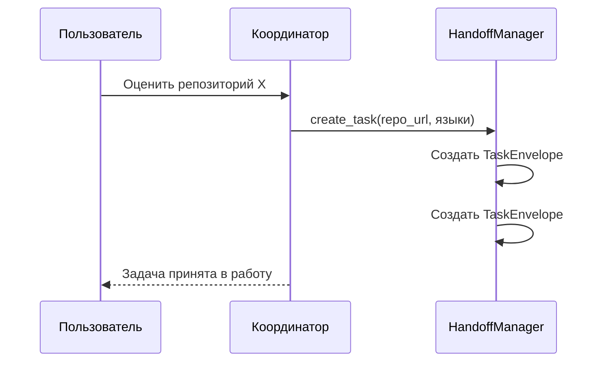

# Этап 1: Создание и распределение задач

```mermaid
sequenceDiagram
    participant User as Пользователь
    participant Coord as Координатор
    participant Handoff as HandoffManager

    User->>Coord: Оценить репозиторий X
    Coord->>Handoff: create_task(repo_url, языки)
    Handoff->>Handoff: Создать TaskEnvelope #1 (Python+SQL)
    Handoff->>Handoff: Создать TaskEnvelope #2 (JS+HTML)
    Coord-->>User: Задача принята в работу
``` 