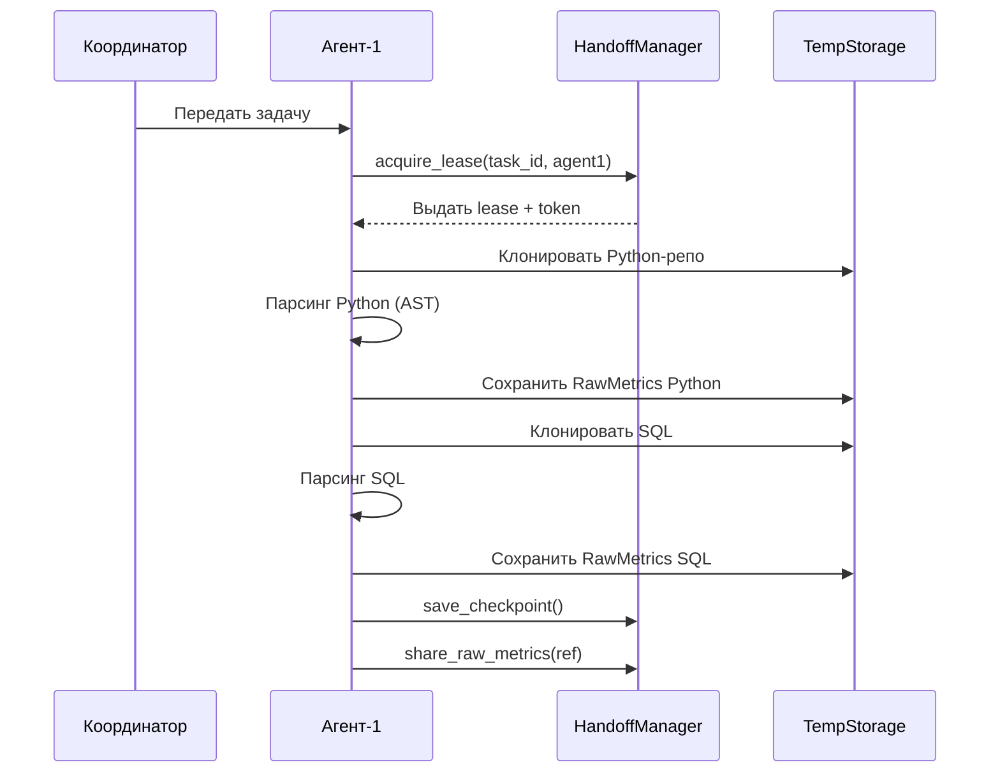

# Этап 2: Работа Агента-1 (Python + SQL)

```mermaid

sequenceDiagram
    participant Coord as Координатор
    participant Agent1 as Агент-1
    participant Handoff as HandoffManager
    participant Temp as TempStorage

    Coord->>Agent1: Передать задачу #1
    Agent1->>Handoff: acquire_lease(task_id, agent1)
    Handoff-->>Agent1: Выдать lease + token

    Agent1->>Temp: Клонировать Python-репо
    Agent1->>Agent1: Парсинг Python (AST)
    Agent1->>Temp: Сохранить RawMetrics Python

    Agent1->>Temp: Клонировать SQL
    Agent1->>Agent1: Парсинг SQL
    Agent1->>Temp: Сохранить RawMetrics SQL

    Agent1->>Handoff: save_checkpoint()
    Agent1->>Handoff: share_raw_metrics(ref)
``` 

