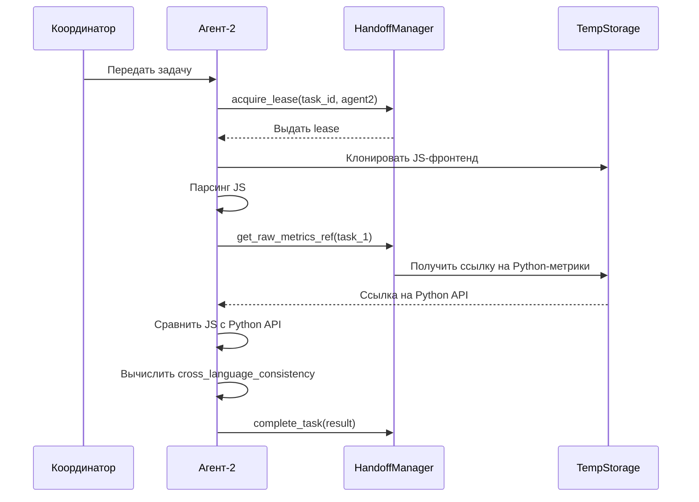

# Этап 3: Работа Агента-2 (JS + HTML) и обмен данными

```mermaid

sequenceDiagram
    participant Coord as Координатор
    participant Agent2 as Агент-2
    participant Handoff as HandoffManager
    participant Temp as TempStorage

    Coord->>Agent2: Передать задачу #2
    Agent2->>Handoff: acquire_lease(task_id, agent2)
    Handoff-->>Agent2: Выдать lease

    Agent2->>Temp: Клонировать JS-фронтенд
    Agent2->>Agent2: Парсинг JS

    Agent2->>Handoff: get_raw_metrics_ref(task_1)
    Handoff->>Temp: Получить ссылку на Python-метрики
    Temp-->>Agent2: Ссылка на Python API

    Agent2->>Agent2: Сравнить JS с Python API
    Agent2->>Agent2: Вычислить cross_language_consistency

    Agent2->>Handoff: complete_task(result)
```    
