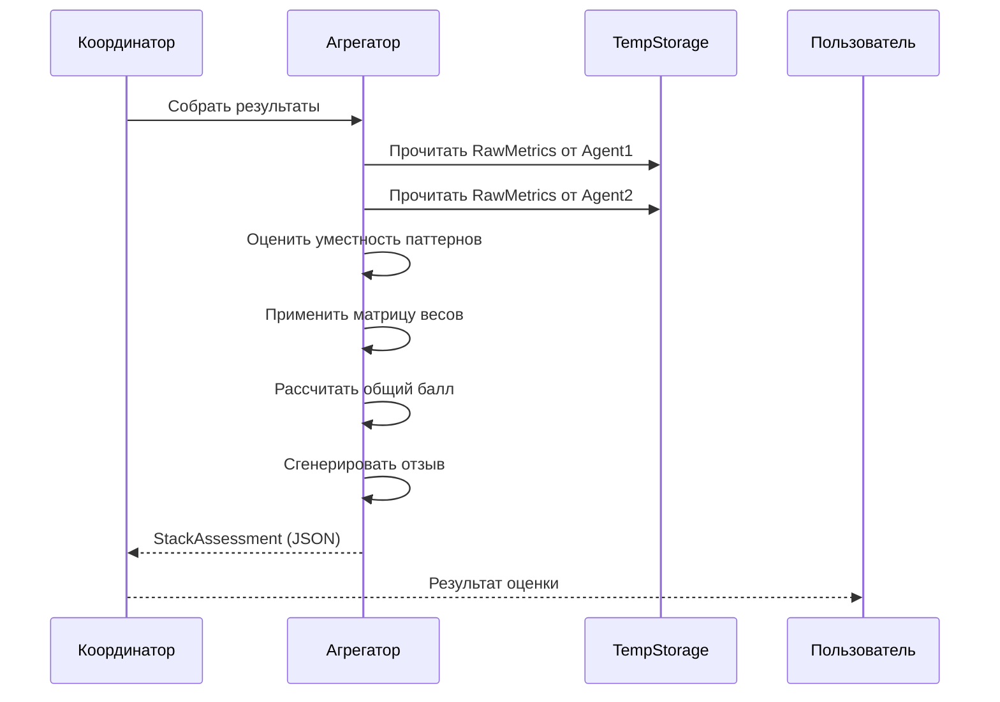

# Этап 4: Агрегация результатов и генерация отзыва

```mermaid
sequenceDiagram
    participant Coord as Координатор
    participant Agg as Агрегатор
    participant Temp as TempStorage
    participant User as Пользователь

    Coord->>Agg: Собрать результаты
    Agg->>Temp: Прочитать RawMetrics от Agent1
    Agg->>Temp: Прочитать RawMetrics от Agent2

    Agg->>Agg: Оценить уместность паттернов
    Agg->>Agg: Применить матрицу весов
    Agg->>Agg: Рассчитать общий балл
    Agg->>Agg: Сгенерировать отзыв

    Agg-->>Coord: StackAssessment (JSON)
    Coord-->>User: Результат оценки
```   
